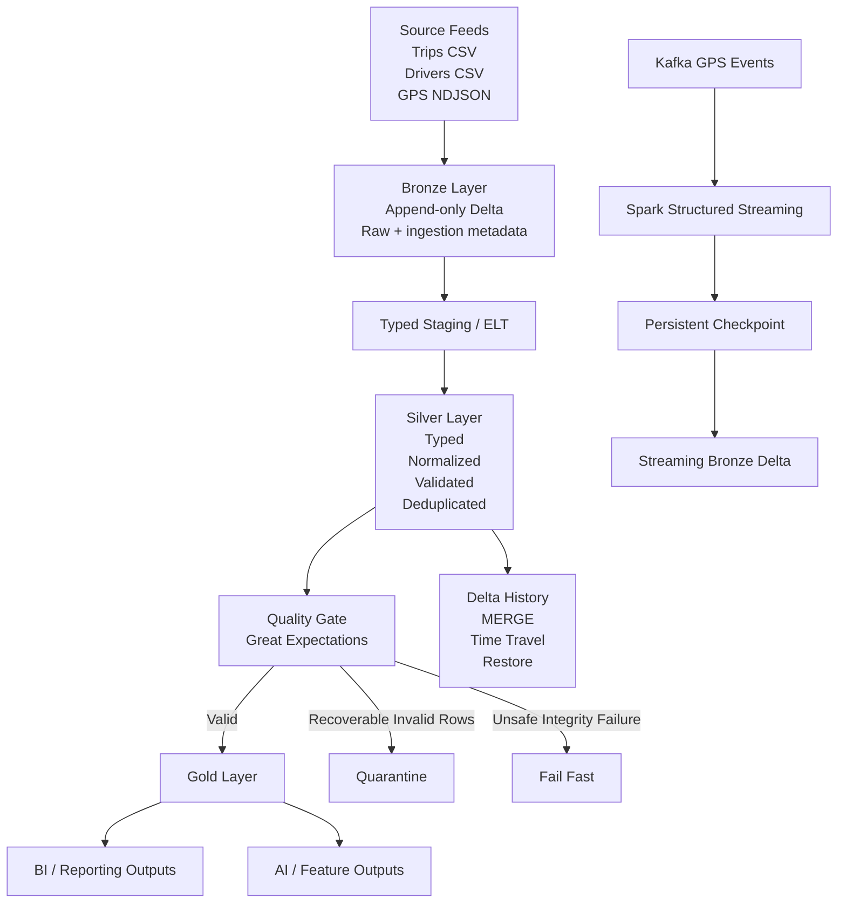

# Masar Mini-Lakehouse — Noura Abdullah

> An end-to-end modern data engineering project implementing a reproducible **Bronze → Silver → Gold** lakehouse with batch ELT, Delta Lake reliability, Kafka streaming, data quality controls, governance, and serving outputs for both BI and AI.

## Project Overview

**Masar Mini-Lakehouse** is a cumulative data engineering project developed across eight labs as part of the **Modern Data Engineering for AI Systems (SDA-DSC-214)** programme [@SADAIA Academy](https://github.com/SDAIAAcademy).

The project models **Masar**, a fictional ride-hailing operator serving Riyadh, Jeddah, and Dammam.

Masar receives three main data feeds:

- Completed trips in CSV format.
- Driver reference data in CSV format.
- GPS location events in newline-delimited JSON format.

The pipeline is designed around realistic data engineering challenges such as:

- Duplicate deliveries.
- Late-arriving data.
- Corrections after ingestion.
- Schema changes.
- Invalid records.
- Streaming restarts.
- Data quality failures.
- Reproducibility.
- Governance and retention requirements.

The final result is a working **Mini-Lakehouse** that preserves raw data in Bronze, creates a trusted and deduplicated Silver layer, produces Gold outputs for BI and AI consumers, validates quality before promotion, and retains evidence for reproducibility and auditing.

> **Data Notice:** All data used in this project is synthetic and fictional. No real rider, driver, location, credential, or personal data is included.

---

## Programme

This project was developed as part of:

**Modern Data Engineering for AI Systems — SDA-DSC-214**  
**SDAIA Academy**

Course materials and project framework by **Meaad Al-Marri**.

SDAIA Academy GitHub:  
https://github.com/SDAIAAcademy

Student Repository:  
https://github.com/Nouraaabdullah/Masar_Data_Engineering

**#SDAIAAcademy**

---

## Problem Statement

A collection of raw files is not enough to build a reliable data platform.

The Masar pipeline must answer several engineering questions:

1. How can raw data be preserved exactly as received while maintaining lineage?
2. How can duplicate deliveries become one trusted business record?
3. How can late-arriving data be processed safely?
4. How can corrections and schema changes be applied without losing history?
5. How can GPS events be ingested continuously without loss or duplication?
6. How can invalid data be blocked or quarantined before reaching trusted outputs?
7. How can the same data lineage support both BI reporting and AI features?
8. How can the entire pipeline be rerun safely and produce reproducible results?

The project solves these problems through a **medallion lakehouse architecture**, Delta Lake reliability mechanisms, streaming checkpoints, quality gates, and governance controls.

---

# Architecture



---

# Medallion Architecture

## Bronze Layer

The Bronze layer acts as the **archive of record**.

It stores the source feeds as received and preserves ingestion history.

Main guarantees:

- Data is stored in real Delta tables.
- Source metadata is retained.
- Ingestion metadata is retained.
- Data is append-only.
- Intentional source replays are preserved.
- Raw records are not silently corrected.
- Downstream layers can be rebuilt from Bronze.

Bronze represents:

> What arrived, exactly as it arrived.

An intentional replay causes the trip Bronze table to grow from:

```text
72 rows
```

to:

```text
144 rows
```

while still representing:

```text
72 distinct business trips
```

The duplication is intentionally preserved in Bronze and resolved later in Silver.

---

## Silver Layer

The Silver layer provides the **trusted business representation**.

Silver performs:

- Explicit type conversion.
- Timestamp normalization.
- City label conformance.
- Driver relationship validation.
- Deduplication.
- Late-arriving data processing.
- Incremental updates.
- Deterministic precedence.
- Idempotent reruns.

Silver defines one trusted version of each business trip.

The late-arriving scenario expands the trusted trip set from:

```text
72 trips
```

to:

```text
75 trips
```

The trusted total fare after late-arriving records is:

```text
SAR 1,875.60
```

The pipeline verifies that replaying the same logical input does not create duplicate trusted records.

---

## Gold Layer

Gold contains data products designed for downstream consumers.

Two types of consumers are served from the same trusted lineage.

### BI / Reporting

Gold reporting outputs are aggregated to a clearly defined reporting grain.

They are intended for:

- Business reporting.
- Operational analytics.
- KPI calculation.
- Dashboard consumption.

### AI / Feature Engineering

Gold AI outputs provide feature-ready data.

Important requirements include:

- Explicit feature grain.
- Point-in-time correctness.
- No future-information leakage.
- Reproducibility from trusted Silver data.

The BI and AI outputs descend from the same Silver source, preventing multiple conflicting definitions of business truth.

---

# Streaming Architecture

The streaming portion of the project uses:

```text
GPS Producer
      ↓
Apache Kafka
      ↓
Spark Structured Streaming
      ↓
Persistent Checkpoint
      ↓
Delta Bronze
```

Kafka is used as the event transport layer.

Spark Structured Streaming consumes the Kafka topic and writes events into Delta.

Each streaming query uses its own persistent checkpoint.

This allows the stream to stop and restart while preserving processing state.

The project demonstrates:

- Kafka producer and consumer behaviour.
- Spark Kafka source integration.
- Persistent checkpoints.
- Restart recovery.
- Duplicate delivery handling.
- Event-time processing.
- Late-event handling.

The restart scenario verifies that the streaming pipeline resumes without silently creating gaps or duplicate trusted events.

---

# Data Quality

A **Great Expectations** suite is used at the promotion boundary.

The quality gate checks data before it is promoted to trusted outputs.

The project demonstrates two different responses to quality failures.

## Fail-Fast

Used for unsafe integrity failures.

Examples include:

```text
NULL business key
Duplicate primary business key
Invalid schema
```

In these cases, the pipeline blocks promotion completely.

This prevents structurally unsafe data from reaching downstream consumers.

---

## Quarantine

Used for partial and recoverable row-level failures.

Example:

```text
Invalid fare value
```

In this case:

```text
Valid rows → promoted
Invalid rows → quarantine
```

Quarantined records retain the reason for rejection.

This ensures that invalid data is not silently dropped.

---

# Delta Lake Reliability

Delta Lake provides the transaction layer of the project.

The implementation demonstrates:

- ACID transactions.
- Transaction logs.
- Schema enforcement.
- CHECK constraints.
- MERGE operations.
- Idempotent corrections.
- Version history.
- Time travel.
- Restore.
- Safe maintenance exercises.

---

## Schema Enforcement

Writes with incompatible schemas are rejected.

The pipeline does not silently coerce incompatible values into trusted tables.

---

## Constraints

Trusted tables enforce business rules.

Examples include:

```text
fare_sar > 0
```

and valid trip duration rules.

Invalid writes are intentionally tested and rejected.

---

## MERGE and Idempotency

Corrections are applied through Delta `MERGE`.

The correction process is executed twice.

The first run applies the required updates.

The second run identifies the same matching records but produces:

```text
updated = 0
```

This demonstrates **idempotency**.

The same logical input can be safely rerun without repeatedly changing the trusted business state.

---

## Time Travel

Delta history allows previous versions of trusted tables to be inspected.

This supports:

- Auditability.
- Reproducibility.
- Recovery.
- Debugging.

Earlier table versions can be compared with later versions to understand exactly what changed.

---

# Project Labs

| Lab | Stage | Main Goal |
|---|---|---|
| **Lab 01** | Bronze | Inspect and land raw feeds as append-only Delta with lineage metadata |
| **Lab 02** | Cost & Scan Evidence | Compare compute/storage choices and measure Spark scan behaviour |
| **Lab 03** | Silver | Type, normalize, validate, deduplicate, process late data and prove idempotency |
| **Lab 04** | Delta Reliability | Test schema enforcement, constraints, MERGE, history and time travel |
| **Lab 05** | Streaming | Run Kafka + Structured Streaming with persistent checkpoints and restart recovery |
| **Lab 06** | Quality & Governance | Run Great Expectations, quarantine failures and document governance |
| **Lab 07** | Integration | Execute the full Bronze → Silver → Gold dependency chain |
| **Lab 08** | Serving | Produce AI and BI outputs and reconcile trusted totals |

---

# Dataset

The project uses a deliberately small synthetic dataset so that the engineering behaviour can be inspected directly.

| Source | Base Records |
|---|---:|
| Trips | 72 |
| Drivers | 6 |
| GPS Events | 216 |

The project also includes synthetic fixtures for:

- Replay scenarios.
- Late-arriving trips.
- Corrections.
- Schema changes.
- GPS replay events.
- Late GPS events.
- Quality test cases.

The small dataset makes the engineering logic visible without requiring large-scale compute.

---

# Technology Stack

| Technology | Purpose |
|---|---|
| **Python 3.11.16** | Project runtime |
| **Java 17** | JVM runtime |
| **PySpark 3.5.8** | Batch and streaming processing |
| **Delta Lake 3.3.3** | ACID tables, MERGE, schema enforcement and time travel |
| **Apache Kafka 4.0.2** | Event streaming |
| **Spark Structured Streaming** | Continuous GPS ingestion |
| **Great Expectations** | Data quality validation |
| **dbt** | Transformation and model documentation |
| **Docker Desktop** | Local Kafka runtime |
| **Jupyter** | Lab execution |
| **VS Code** | Development environment |
| **Git / GitHub** | Version control and submission |

---

# Verified Environment

The project was successfully executed locally using:

```text
Operating System: macOS
Architecture: Apple Silicon
Python: 3.11.16
Java: 17
PySpark: 3.5.8
Delta Lake: 3.3.3
Kafka: 4.0.2
IDE: Visual Studio Code
```

VS Code extensions used:

```text
Python
Jupyter
```

---

# Repository Structure

```text
Masar_Data_Engineering/
│
├── day01/
│   └── STUDENT.ipynb
│
├── day02/
│   └── STUDENT.ipynb
│
├── day03/
│   └── STUDENT.ipynb
│
├── day04/
│   └── STUDENT.ipynb
│
├── day05/
│   └── STUDENT.ipynb
│
├── Masar_All_Labs.ipynb
├── merge_notebooks.py
│
├── src/
│   └── masar/
│
├── data/
├── infrastructure/
├── project/
├── scripts/
├── tests/
├── tools/
│
├── LAB01_NOTES.md
├── LAB02_NOTES.md
├── LAB03_NOTES.md
├── LAB04_NOTES.md
├── LAB05_NOTES.md
├── LAB06_NOTES.md
├── LAB07_NOTES.md
├── LAB08_NOTES.md
│
├── BENCHMARKS.md
├── GOVERNANCE.md
├── DECISIONS.md
│
├── requirements-course.txt
├── .gitignore
└── README.md
```

The five daily `STUDENT.ipynb` notebooks remain the main lab evidence.

`Masar_All_Labs.ipynb` is an additional combined notebook containing all labs in one sequential execution flow.

---

# Installation

## 1. Clone the Repository

```bash
git clone https://github.com/Nouraaabdullah/Masar_Data_Engineering.git
cd Masar_Data_Engineering
```

---

## 2. Create the Python Environment

Python 3.11 is required.

Using `venv`:

```bash
python3.11 -m venv .venv
source .venv/bin/activate
```

Alternatively, using `uv`:

```bash
brew install uv
uv python install 3.11
uv venv --python 3.11 --seed .venv
source .venv/bin/activate
```

Verify:

```bash
python --version
```

Expected:

```text
Python 3.11.x
```

---

## 3. Install Dependencies

```bash
python -m pip install --upgrade pip setuptools wheel
```

Then:

```bash
python -m pip install -r requirements-course.txt
```

---

## 4. Configure Java 17

On macOS:

```bash
brew install openjdk@17
```

Set the environment:

```bash
export JAVA_HOME="$(brew --prefix openjdk@17)/libexec/openjdk.jdk/Contents/Home"
export PATH="$JAVA_HOME/bin:$PATH"
```

Verify:

```bash
java -version
```

Expected:

```text
openjdk version "17..."
```

---

# Kafka Setup

Docker Desktop is required for the Kafka streaming lab.

Install Docker:

```bash
brew install --cask docker
```

Open Docker Desktop:

```bash
open -a Docker
```

Verify:

```bash
docker --version
docker compose version
```

The local Kafka broker used during the verified run was started with:

```bash
docker run -d \
  --name masar-kafka \
  -p 127.0.0.1:9092:9092 \
  -e KAFKA_NODE_ID=1 \
  -e KAFKA_PROCESS_ROLES=broker,controller \
  -e KAFKA_LISTENERS=PLAINTEXT://:9092,CONTROLLER://:29093 \
  -e KAFKA_ADVERTISED_LISTENERS=PLAINTEXT://127.0.0.1:9092 \
  -e KAFKA_LISTENER_SECURITY_PROTOCOL_MAP=PLAINTEXT:PLAINTEXT,CONTROLLER:PLAINTEXT \
  -e KAFKA_INTER_BROKER_LISTENER_NAME=PLAINTEXT \
  -e KAFKA_CONTROLLER_LISTENER_NAMES=CONTROLLER \
  -e KAFKA_CONTROLLER_QUORUM_VOTERS=1@localhost:29093 \
  -e KAFKA_OFFSETS_TOPIC_REPLICATION_FACTOR=1 \
  -e KAFKA_TRANSACTION_STATE_LOG_REPLICATION_FACTOR=1 \
  -e KAFKA_TRANSACTION_STATE_LOG_MIN_ISR=1 \
  -e KAFKA_AUTO_CREATE_TOPICS_ENABLE=true \
  -e CLUSTER_ID=MkU3OEVBNTcwNTJENDM2Qk \
  apache/kafka:4.0.2
```

Verify that Kafka is reachable:

```bash
nc -zv 127.0.0.1 9092
```

Expected:

```text
Connection to 127.0.0.1 port 9092 succeeded!
```

---

# How to Run

## Option 1 — Run the Daily Notebooks

Open the project in VS Code:

```bash
code .
```

Select the Jupyter kernel:

```text
.venv (Python 3.11.x)
```

Run the notebooks in this order:

```text
day01/STUDENT.ipynb
        ↓
day02/STUDENT.ipynb
        ↓
day03/STUDENT.ipynb
        ↓
day04/STUDENT.ipynb
        ↓
day05/STUDENT.ipynb
```

The order matters because each day builds on the outputs and evidence from the previous day.

---

## Option 2 — Run the Combined Notebook

The repository also contains:

```text
Masar_All_Labs.ipynb
```

This notebook combines the five daily notebooks into one sequential workflow.

Before running it:

```text
1. Activate .venv
2. Verify Python 3.11
3. Verify Java 17
4. Start Kafka
5. Select the .venv kernel
6. Restart the kernel
7. Run cells in order
```

Example environment startup:

```bash
cd ~/Desktop/Masar_Data_Engineering

source .venv/bin/activate

export JAVA_HOME="$(brew --prefix openjdk@17)/libexec/openjdk.jdk/Contents/Home"

export PATH="$JAVA_HOME/bin:$PATH"
```

Then confirm:

```bash
python --version
java -version
nc -zv 127.0.0.1 9092
```

---

# Key Results

## Bronze

The Bronze pipeline successfully demonstrates:

```text
Source validation
Append-only Delta ingestion
Ingestion metadata
Source metadata
Replay preservation
Raw lineage
```

The intentional replay produces:

```text
144 Bronze trip delivery rows
72 distinct business trips
```

This is expected behaviour.

Bronze preserves delivery history rather than silently removing duplicate deliveries.

---

## Silver

Silver converts raw delivery data into a trusted business table.

The pipeline demonstrates:

```text
Typed columns
Timestamp normalization
City normalization
Driver validation
Deterministic deduplication
Late-arrival handling
Idempotent processing
```

After processing the fixed late-trip scenario:

```text
Trusted trips: 75
Total fare: SAR 1,875.60
```

Rerunning the same logical data preserves the same trusted business content.

---

## Delta Reliability

The project demonstrates:

```text
Delta transaction logs
Schema enforcement
CHECK constraints
MERGE
Idempotent corrections
Time travel
Version history
Restore
Maintenance exercises
```

Invalid writes are intentionally tested.

A bad schema does not silently enter the trusted table.

Invalid business values are rejected by constraints.

The repeated correction MERGE results in no additional logical updates after the first successful correction.

---

## Streaming

The streaming pipeline demonstrates:

```text
Kafka producer
Kafka consumer
Spark Structured Streaming
Dedicated checkpoints
Stop and restart
Replay handling
Late events
```

Kafka runs locally at:

```text
127.0.0.1:9092
```

The restart scenario validates that processing can resume from persistent state rather than blindly starting from the beginning.

---

## Quality Gate

The Great Expectations quality boundary demonstrates:

```text
Integrity validation
Fail-fast behaviour
Quarantine
Failure reasons
Promotion blocking
```

Unsafe failures prevent trusted publication.

Recoverable row-level defects are quarantined rather than silently discarded.

---

## Serving

The final serving layer produces outputs for:

```text
BI / reporting
AI / feature engineering
```

Both are derived from the same trusted lineage.

The final workflow reconciles trip and fare totals between the trusted table and the reporting output.

This ensures that published BI results agree with the trusted upstream business data.

---

# Reliability Properties

| Property | How It Is Demonstrated |
|---|---|
| Append-only history | Bronze preserves repeated deliveries |
| Idempotency | Same logical input produces the same trusted result |
| Schema enforcement | Invalid schema writes are rejected |
| Constraint enforcement | Invalid business values fail before promotion |
| ACID | Delta transaction log controls committed table state |
| Time travel | Earlier table versions can be inspected |
| Safe corrections | MERGE applies deterministic business changes |
| Restart recovery | Streaming resumes using persistent checkpoints |
| Quality gating | Unsafe data is blocked or quarantined |
| Reconciliation | Gold/BI outputs are checked against trusted data |
| Governance | Ownership, lineage, access and retention are documented |

---

# Data Contract and Grains

## Bronze

**Grain:** one received source record or event delivery.

Bronze may contain repeated deliveries because it represents source arrival history.

---

## Silver Trips

**Grain:** one trusted business trip per documented business key.

Silver is the canonical trip representation used by downstream transformations.

---

## Streaming Bronze

**Grain:** one ingested GPS/event record according to the event identifier and streaming checkpoint state.

---

## Gold Reporting

**Grain:** reporting-specific aggregate grain defined by the Gold model.

---

## Gold AI Features

**Grain:** feature records at the documented entity/time grain.

Only information available at the allowed prediction time is included.

---

# Important Engineering Decisions

More detailed reasoning is documented in:

```text
DECISIONS.md
```

The most important decisions include:

### 1. Bronze Is Immutable

Bronze preserves delivery history.

Duplicate source deliveries are not deleted from Bronze.

Deduplication belongs in Silver.

---

### 2. Silver Uses Deterministic Deduplication

A documented business key and precedence rule determine which business record becomes trusted.

This allows safe reruns and late-arriving data processing.

---

### 3. Quality Failures Are Treated According to Risk

Unsafe integrity failures block publication.

Recoverable row-level defects are quarantined with a reason.

---

### 4. Streaming Queries Use Independent Checkpoints

Checkpoint state belongs to a specific streaming query.

Independent streaming queries should not share checkpoint state.

---

### 5. Reconciliation Uses Business Content

Two pipeline runs may have different runtime timestamps while still producing the same business result.

Therefore, correctness is evaluated using logical content rather than volatile runtime metadata.

---

### 6. BI and AI Share One Trusted Lineage

Both downstream consumers are built from the same trusted Silver data.

This reduces the risk of different teams maintaining conflicting definitions of the same business metric.

---

# Governance

Full governance documentation is available in:

```text
GOVERNANCE.md
```

The project records:

```text
Lineage
Ownership
Intended access
Retention
Data classification
Quality controls
Promotion rules
Synthetic-data handling
```

No real personal data is used.

Governance concepts such as:

```text
Location sensitivity
Data minimisation
Retention
Erasure
Restricted access
```

are demonstrated only using synthetic course scenarios.

---

# Benchmarking

Benchmark methodology and results are documented in:

```text
BENCHMARKS.md
```

The benchmark work includes:

```text
Compute/storage separation
Cost assumptions
Spark scan measurements
Query-plan observations
Equal-result checks
Measurement limitations
```

The measured timings are local educational observations.

They are **not production performance benchmarks**.

---

# Evidence

The repository preserves evidence through:

```text
Executed notebooks with outputs retained
LAB01_NOTES.md → LAB08_NOTES.md
BENCHMARKS.md
GOVERNANCE.md
DECISIONS.md
Generated reports
Negative tests
Quarantine evidence
Rejected writes
Streaming restart tests
Final reconciliation
```

The project intentionally records failures as well as successful runs.

A reliable pipeline should prove not only that valid data works, but also that invalid data fails safely.

---

# Limitations

This project is a training-scale implementation.

Important limitations include:

- The base dataset contains only **72 synthetic trips**.
- The driver dataset contains only **6 drivers**.
- The base GPS dataset contains only **216 events**.
- All data is fictional.
- The project runs locally rather than on a production distributed cluster.
- Kafka uses a local single-node broker.
- Local runtime measurements do not represent production throughput.
- The project does not implement production IAM.
- The project does not implement cloud high availability.
- The project does not implement disaster recovery.
- The project does not use real personal data.
- The project does not represent a production deployment.
- Timing measurements should not be interpreted as production benchmarks.
- `Masar_All_Labs.ipynb` is a convenience notebook; the five daily notebooks remain the primary lab evidence.

---

# Reproducibility

A reviewer should be able to reproduce the project by:

```text
1. Clone the repository
2. Create a Python 3.11 environment
3. Install requirements-course.txt
4. Configure Java 17
5. Start Kafka before the streaming lab
6. Select the .venv Jupyter kernel
7. Run the notebooks in dependency order
8. Inspect retained outputs
9. Inspect lab notes and generated reports
10. Verify negative-test behaviour
11. Verify final BI/trusted-data reconciliation
```

The pipeline is cumulative.

Later labs intentionally consume the trusted outputs and evidence produced by earlier labs.

---

# Credits

This project was developed as part of:

**Modern Data Engineering for AI Systems — SDA-DSC-214**

at:

**SDAIA Academy**

Course materials and project framework by:

**Meaad Al-Marri**

Links:

SDAIA Academy:  
https://github.com/SDAIAAcademy

Original Course Repository:  
https://github.com/almiyead-rgb/masar-modern-data-engineering

Student Repository:  
https://github.com/Nouraaabdullah/Masar_Data_Engineering

**SDAIA Academy · SDA-DSC-214 · Modern Data Engineering for AI Systems**

**#SDAIAAcademy**
